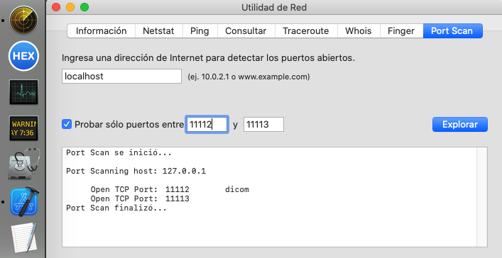

# Instalación pcs2 SAINTBOIS + HOSPOJOS

Se dedican puertos distintos para las dos orgs, empezando en 4096 para el servicio storescp y en 11112 para el servicio findscp:

Dos opciones:

## Opción rápida

```
sudo /Users/Shared/install/install1.sh asseSAINTBOIS
sudo /Users/Shared/install/install2.sh asseHOSPOJOS
```

install1 reservas los puertos 4096 y 11112 e instala tambien storedicom

install2 reservas los puertos 4097 y 11113

Es sencillo duplicar install2 como install[n] y cambiar los puertos dentro de los duplicados, para realizar instalaciones de más de dos organizaciones dentro del mismo pcs2


## Opción lenta

- asseSAINTBOIS recibe imágenes en asseSAINTBOIS@pcs2:4096 y la worklist correspondiente está consultada en DCM4CHEE@pcs2:11112

```
sudo /Users/Shared/dcmtk/storescp/install.sh asseSAINTBOIS 4096;

sudo /Users/Shared/dcmtk/wlmscpfs/install.sh asseSAINTBOIS 11112 DCM4CHEE;

sudo /Users/Shared/opendicom/cdamwldicom/install.sh asseSAINTBOIS DCM4CHEE "https://serviciosridi.asse.uy/dcm4chee-arc/qido/DCM4CHEE/instances?Modality=OT&amp;00080080=asseSAINTBOIS&amp;SeriesDescription=solicitud&amp;NumberOfStudyRelatedInstances=1&amp;StudyDate=";

sudo /Users/Shared/opendicom/coercedicom/install.sh asseSAINTBOIS DCM4CHEE;

```

- asseHOSPOJOS recibe imágenes en asseHOSPOJOS@pcs2:4097 y la worklist correspondiente está consultada en DCM4CHEE@pcs2:11113

```
sudo /Users/Shared/dcmtk/storescp/install.sh asseHOSPOJOS 4097;

sudo /Users/Shared/dcmtk/wlmscpfs/install.sh asseHOSPOJOS 11113 DCM4CHEE;

sudo /Users/Shared/opendicom/cdamwldicom/install.sh asseHOSPOJOS DCM4CHEE "https://serviciosridi.asse.uy/dcm4chee-arc/qido/DCM4CHEE/instances?Modality=OT&amp;00080080=asseHOSPOJOS&amp;SeriesDescription=solicitud&amp;NumberOfStudyRelatedInstances=1&amp;StudyDate=";

sudo /Users/Shared/opendicom/coercedicom/install.sh asseHOSPOJOS DCM4CHEE;
```

Finalmente ambos servicios tienen como destino el mismo PACS de asse y comparten el mismo demonio de envío

```
sudo /Users/Shared/opendicom/storedicom/install.sh DCM4CHEE "https://serviciosridi.asse.uy/dcm4chee-arc/stow/DCM4CHEE/studies" CURL_SILENT;
```


# Verificación de la instalación

### Existencia de las carpetas correspondiente a los servicios:

- /Users/pcs2/Documents/

  - dcmtk/
    -  [storescp.asseHOSPOJOS.4097.error.log](../pcs2/Documents/dcmtk/storescp.asseHOSPOJOS.4097.error.log) 
    -  [storescp.asseHOSPOJOS.4097.log](../pcs2/Documents/dcmtk/storescp.asseHOSPOJOS.4097.log) 
    -  [storescp.asseSAINTBOIS.4096.error.log](../pcs2/Documents/dcmtk/storescp.asseSAINTBOIS.4096.error.log) 
    -  [storescp.asseSAINTBOIS.4096.log](../pcs2/Documents/dcmtk/storescp.asseSAINTBOIS.4096.log) 
    -  [wlmscpfs.asseHOSPOJOS.DCM4CHEE.11113.error.log](../pcs2/Documents/dcmtk/wlmscpfs.asseHOSPOJOS.DCM4CHEE.11113.error.log) 
    -  [wlmscpfs.asseHOSPOJOS.DCM4CHEE.11113.log](../pcs2/Documents/dcmtk/wlmscpfs.asseHOSPOJOS.DCM4CHEE.11113.log) 
    -  [wlmscpfs.asseSAINTBOIS.DCM4CHEE.11112.error.log](../pcs2/Documents/dcmtk/wlmscpfs.asseSAINTBOIS.DCM4CHEE.11112.error.log) 
    -  [wlmscpfs.asseSAINTBOIS.DCM4CHEE.11112.log](../pcs2/Documents/dcmtk/wlmscpfs.asseSAINTBOIS.DCM4CHEE.11112.log) 

  - opendicom/
    -  [cdamwldicom.asseHOSPOJOS.DCM4CHEE.error.log](../pcs2/Documents/opendicom/cdamwldicom.asseHOSPOJOS.DCM4CHEE.error.log) 
    -  [cdamwldicom.asseHOSPOJOS.DCM4CHEE.log](../pcs2/Documents/opendicom/cdamwldicom.asseHOSPOJOS.DCM4CHEE.log) 
    -  [cdamwldicom.asseSAINTBOIS.DCM4CHEE.error.log](../pcs2/Documents/opendicom/cdamwldicom.asseSAINTBOIS.DCM4CHEE.error.log) 
    -  [cdamwldicom.asseSAINTBOIS.DCM4CHEE.log](../pcs2/Documents/opendicom/cdamwldicom.asseSAINTBOIS.DCM4CHEE.log) 
    -  [coercedicom.asseHOSPOJOS.error.log](../pcs2/Documents/opendicom/coercedicom.asseHOSPOJOS.error.log) 
    -  [coercedicom.asseHOSPOJOS.log](../pcs2/Documents/opendicom/coercedicom.asseHOSPOJOS.log) 
    -  [coercedicom.asseSAINTBOIS.error.log](../pcs2/Documents/opendicom/coercedicom.asseSAINTBOIS.error.log) 
    -  [coercedicom.asseSAINTBOIS.log](../pcs2/Documents/opendicom/coercedicom.asseSAINTBOIS.log) 
    -  [storedicom.DCM4CHEE.error.log](../pcs2/Documents/opendicom/storedicom.DCM4CHEE.error.log) 
    -  [storedicom.DCM4CHEE.log](../pcs2/Documents/opendicom/storedicom.DCM4CHEE.log) 

- /Volumes/IN/

  - asseHOSPOJOS/
  - asseSAINTBOIS/
  - DCM4CHEE/

- /Library/LauchDaemons/
  - storescp.asseHOSPOJOS.4097.plist
  - storescp.asseSAINTBOIS.4096.plist
  - wlmscpfs.asseHOSPOJOS.DCM4CHEE.11113.plist
  - wlmscpfs.asseSAINTBOIS.DCM4CHEE.11112.plist
- /Users/pcs2/Library/LauchAgents/
  - cdamwldicom.asseHOSPOJOS.DCM4CHEE.plist
  - cdamwldicom.asseSAINTBOIS.DCM4CHEE.plist
  - coercedicom.asseHOSPOJOS.plist
  - coercedicom.asseSAINTBOIS.plist
  - olditems.asseHOSPOJOS.DCM4CHEE.plist
  - olditems.asseSAINTBOIS.DCM4CHEE.plist
  - storedicom.DCM4CHEE.plist
- /Users/Shared/
  - dcmtk/
    - storescp/
      - asseHOSPOJOS/
      - asseSAINTBOIS/
    - wlmscpfs/
      - asseHOSPOJOS/
      - asseSAINTBOIS/
  - opendicom/
    - cdamwldicom
      - asseHOSPOJOS/
      - asseSAINTBOIS/
    - coercedicom/
      - asseHOSPOJOS/
      - asseSAINTBOIS/
    - storedicom/
      - DCM4CHEE/


# Iniciar todos los servicios

```
/Users/Shared/start_all.sh 
```

```
-	0	cdamwldicom.asseHOSPOJOS.DCM4CHEE.plist
-	0	cdamwldicom.asseHOSPOJOS.DCM4CHEE
-	0	olditems.asseHOSPOJOS.DCM4CHEE.plist
-	0	cdamwldicom.asseSAINTBOIS.DCM4CHEE.plist
-	0	olditems.asseSAINTBOIS.DCM4CHEE.plist
-	0	storedicom.DCM4CHEE.plist
-	0	coercedicom.asseHOSPOJOS.plist
-	0	coercedicom.asseSAINTBOIS.plist
-	0	coercedicom.asseHOSPOJOS.plist
7448	0	storescp.asseHOSPOJOS.4097.plist
7455	0	storescp.asseSAINTBOIS.4096.plist
7462	0	wlmscpfs.asseHOSPOJOS.DCM4CHEE.11113.plist
7469	0	wlmscpfs.asseSAINTBOIS.DCM4CHEE.11112.plist
```

Storescp y wlmscpfs tienen un nro de proceso porque están abiertos en forma permanente para escuchar sus puertos respectivos.

Se puede comprobar la apertura de los puertos usando el programa "utilidad de red"




# Terminar todos los servicios

```
/Users/Shared/stop_all.sh 
```

```
-	0	cdamwldicom.asseHOSPOJOS.DCM4CHEE.plist
-	0	cdamwldicom.asseHOSPOJOS.DCM4CHEE
-	0	olditems.asseHOSPOJOS.DCM4CHEE.plist
-	0	cdamwldicom.asseSAINTBOIS.DCM4CHEE.plist
-	0	olditems.asseSAINTBOIS.DCM4CHEE.plist
-	0	storedicom.DCM4CHEE.plist
-	0	coercedicom.asseHOSPOJOS.plist
-	0	coercedicom.asseSAINTBOIS.plist
-	0	coercedicom.asseHOSPOJOS.plist
7448	0	storescp.asseHOSPOJOS.4097.plist
7455	0	storescp.asseSAINTBOIS.4096.plist
7462	0	wlmscpfs.asseHOSPOJOS.DCM4CHEE.11113.plist
7469	0	wlmscpfs.asseSAINTBOIS.DCM4CHEE.11112.plist
```


# Uninstall all

¡Atención! Borra TODAS las organizaciones instaladas y TODOS los objetos dicom tratados.

Es irreversible.

Se puede usar para reciclar un pcs2 para una otra organización

```
sudo /Users/Shared/install/uninstall_all.sh
```

