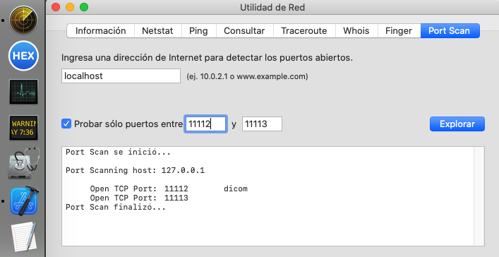

# Instalación PCS2

Todos los instaladores tienen parametros admin org branch.

**admin** es el nombre del usuario administrador. "**pcs2**" en ASSE.

**org** es el nombre del pacs centralizado. "**DCM4CHEE**". en ASSE.

**branch** es el nombre del hospital. Por ejemplo asseRIVERA.


## instaladores dcmtk

Se dedican puertos distintos para branch distintos, empezando en 4096 para el servicio storescp y en 11112 para el servicio findscp de mwl. 

```
sudo ./dcmtk1.sh pcs2 DCM4CHEE [branch1]
sudo ./dcmtk2.sh pcs2 DCM4CHEE [branch2]
sudo ./dcmtk3.sh pcs2 DCM4CHEE [branch3]
```

dcmtk1.sh, dcmtk2.sh dcmtk2.sh son instaladores para branch distintos con puertos (4096,11112) ,  (4097,11113), (4098,11118) respectivame.

Se requiere la instalación desde root para garantizar la apertura de los puertos. Por eso el sudo.

## 

## instaladores opendicom

Se insatala desde el usuario admin. No instalar con sudo.

```
./opendicom1.sh pcs2 DCM4CHEE [branch1]
./opendicom2.sh pcs2 DCM4CHEE [branch2]
```

opendicom2.sh instala coercedicom y cdamwldicom. Se puede usar también para la tercera y las branch siguiente(s).

opendicom1.sh instala coercedicom y cdamwldicom, y además storedicom.

# Verificación de la instalación

# Iniciar todos los servicios

```
/Users/Shared/start_all.sh 
```

Como resultado, lista los servicios iniciados, los que ya estaban corriendo y los eventuales problemas de arranque.

Storescp y wlmscpfs tienen un nro de proceso porque están abiertos en forma permanente para escuchar sus puertos respectivos.

Se puede comprobar la apertura de los puertos usando el programa "utilidad de red"




# Terminar todos los servicios

```
/Users/Shared/stop_all.sh 
```


# Uninstall all

¡Atención! Borra TODAS las organizaciones instaladas y TODOS los objetos dicom tratados.

Es irreversible.

Se puede usar para reciclar un pcs2 para una otra organización

```
sudo /Users/Shared/install/uninstall_all.sh
```

